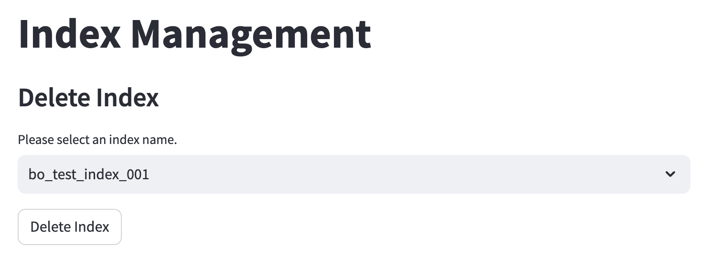

# AOAI-Azure-Search-PDF

## Overview

In this sample, we will show you how to use Azure Search create index and search information from PDF files.
Actually, Azure Search does not support PDF files natively. In this sample, we will use Azure Open AI embedding API convert the content text to vector from PDF files and then use Azure Search to index and search the vector.

In this sample, you will learn how to:

- Azure Open AI Embedding
- List all Azure Search indexes
- Create Azure Search index
- Delete Azure Search index
- Upload data to Azure Search index
- Search data from Azure Search by vector

## Prerequisites

- Azure Subscription
- Azure Search (Azure Cognitive Search)
- Azure Open AI (embedding model - text-embedding-ada-002)
- Azure Opne AI (GPT-3.5 or GPT-4)
- Visual Studio Code
- Docker
- streamlit

## Azure Search

Azure search as know as Azure Cognitive Search, is a search-as-a-service cloud solution that gives developers APIs and tools for adding a rich search experience over private, heterogeneous content in web, mobile, and enterprise applications. Azure Search is a fully managed service that reduces the complexity and costs associated with AI-based search infrastructure management and maintenance. Azure Search is a part of the Microsoft Azure Cognitive Services family of AI APIs and SDKs, which enables developers to easily add cognitive features into their applications. In this sample, we will use Azure Search as a vector search engine.

## Azure Open AI

Azure OpenAI Service provides REST API access to OpenAI's powerful language models including the GPT-4, GPT-35-Turbo, and Embeddings model series. In addition, the new GPT-4 and gpt-35-turbo model series have now reached general availability. These models can be easily adapted to your specific task including but not limited to content generation, summarization, semantic search, and natural language to code translation. Users can access the service through REST APIs, Python SDK, or our web-based interface in the Azure OpenAI Studio. In this sample, we will use Azure Open AI Embeddings model to convert the PDF content text to vector.

## PDF file upload to Azure Search


## Vaector search from Azure Search and summary by Azure Open AI


## How to run this sample

1. Open the project in Visual Studio Code with Dev container
2. Run the following command **streamlit run page_home.py**
3. Open the browser and go to http://localhost:8501
4. input the username and password to login (default username: admin, password: admin123456)

5. Click the **Create Index** menu then create a new index

6. Click the **Upload Data** menu then select the index name you just created and upload PDF file.
    - the PDF doucmnet will upload to server momory and then convert to text first.
    - the text will split to multiple sentences by chunking method.
    - the sentence will convert to vector by Azure Open AI Embedding.
    - the vector will upload to Azure Search index.

    
7. search the content from the PDF file
    - the search text will convert to vector by Azure Open AI Embedding.
    - the vector will search from Azure Search index.
    - the search result will show top 5 result with similarity score for each result.
    - Then will base on the top 5 result to do Azure open AI completion to generate the final result.

    
8. Delete the index. And please note that if you delete the index, all the data will be deleted as well.


## Azure Search Index Management

Please refer code (AzureVectorSearch.py) in this sample this class how to use Azure Search SDK Management to index list existing or create and delete index. for example below code it will do vector search by index. 

```pytho
def vector_similarity_search(self, index_name, vector_fields, search_text):
    search_client = SearchClient(AZURE_SEARCH_SERVICE_ENDPOINT, index_name, credential=self.credential)  
    results = search_client.search(  
        search_text=None,  
        vector=self.generate_embeddings(search_text),
        top_k=5,
        vector_fields=vector_fields,
        select=["product", "category", "content"],
    )
```

- [Azure Search Index Management](https://docs.microsoft.com/en-us/azure/search/search-create-index-portal) to create and delete Azure Search index.

## Azure Open AI Embedding

Please refer code (AzureVectorSearch.py) in this sample this class how to use Azure Open AI Embedding to convert the content text to vector. for example below code it will do vector search by index. 

```python
def generate_embeddings(self, text):
    response = openai.Embedding.create(
        input=text, engine=EMBEDDING_MODEL)
    embeddings = response['data'][0]['embedding']
    return embeddings
```

- [Azure Open AI Embedding](https://docs.microsoft.com/en-us/azure/cognitive-services/openai-content-modelling)

## Chunking

Chunking is a natural language processing technique that involves grouping words together into meaningful units, called chunks. It is often used as a preprocessing step in tasks such as information extraction, named entity recognition, and syntactic parsing.

In chunking, a sentence is divided into chunks based on the grammatical structure and the part-of-speech tags of the words. The most common approach is to use a technique called regular expression chunking, where patterns are defined to match specific sequences of part-of-speech tags.

In this sample will use LangChain to do chunking. LangChain is a Python library for text processing, natural language processing and network analysis. It is designed to be simple and easy to use. It contains tools for data preprocessing, text representation, text classification, clustering, topic modeling, word embedding, network analysis and visualization. In this sample, we will use LangChain to do chunking to split the PDF content text to multiple sentences.

there have two different chunking method in this sample. one is RecursiveCharacterTextSplitter and another one is TokenTextSplitter. you can use any one of them to do chunking.

the parameter chunk_size is the size of the chunk. the parameter chunk_overlap is the overlap size of the chunk. the parameter content is the PDF content text.

```python
class LangChanSplitter:

    def RecursiveCharacterTextSplitter(self, chunk_size, chunk_overlap, content):
        from langchain.text_splitter import RecursiveCharacterTextSplitter
        text_splitter = RecursiveCharacterTextSplitter(
            chunk_size = chunk_size,
            chunk_overlap  = chunk_overlap,
            length_function = len,
        )
        doc_list = text_splitter.create_documents([content])
        contents = [item.page_content for item in doc_list]
        return contents
    
    def TokenTextSplitter(self, chunk_size, chunk_overlap, content):
        from langchain.text_splitter import TokenTextSplitter
        text_splitter = TokenTextSplitter(chunk_size=chunk_size, chunk_overlap=chunk_overlap)
        doc_list = text_splitter.split_text(content)
        return doc_list
```

chinking is a tread off between the accuracy and performance. if you want to get more accurate result you can set the chunk_size to smaller value. but it will impact the performance. if you want to get better performance you can set the chunk_size to bigger value. but it will impact the accuracy.

you may need test the chunking result to see which one is more resonable. for example below code will do chunking with different chunk_size and chunk_overlap.

if you want to know more about LangChain please refer to [LangChain Split](https://python.langchain.com/docs/modules/data_connection/document_transformers/text_splitters/character_text_splitter)